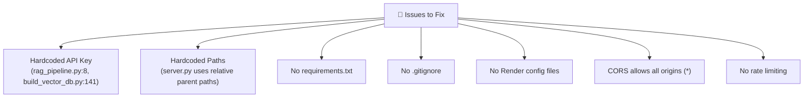

# Deploy CyberLaw Bot to Render

## Project Analysis

### Architecture Summary

| Component | File | Purpose |
|-----------|------|---------|
| **FastAPI Server** | [server.py](file:///d:/Final_Year_Project/Backend/server.py) | Web server, routes, session management |
| **RAG Pipeline** | [rag_pipeline.py](file:///d:/Final_Year_Project/Backend/rag_pipeline.py) | Query → embed → search → Gemini answer |
| **Vector DB Builder** | [build_vector_db.py](file:///d:/Final_Year_Project/Backend/build_vector_db.py) | One-time script to build embeddings |
| **Text Extractor** | [extract_text.py](file:///d:/Final_Year_Project/Backend/extract_text.py) | PDF → text chunks |
| **Frontend** | [index.html](file:///d:/Final_Year_Project/Frontend/index.html), [app.js](file:///d:/Final_Year_Project/Frontend/app.js), [style.css](file:///d:/Final_Year_Project/Frontend/style.css) | Chat UI (static HTML/CSS/JS) |
| **Vector DB** | `vector_db/embeddings.npy` (24.4 MB) + `vector_db/law_kb.json` (1.4 MB) | Pre-built embeddings & document store |
| **PDF Sources** | 4 PDFs in `Backend/` (total ~15 MB) | CrPC, PECA 2016, PECA 2025 Amendment, PPC |

### Key Findings & Issues for Deployment



---

## User Review Required

> [!CAUTION]
> **API Key Exposed in Source Code**: Your Gemini API key `AIza...REDACTED...` is hardcoded in [rag_pipeline.py:8](file:///d:/Final_Year_Project/Backend/rag_pipeline.py#L8) and [build_vector_db.py:141](file:///d:/Final_Year_Project/Backend/build_vector_db.py#L141). If you push this to a public GitHub repo, **anyone can steal and abuse your API key**. We will move it to an environment variable on Render.

> [!WARNING]
> **Large Binary Files**: Your `embeddings.npy` (24.4 MB) and 4 PDFs (~15 MB) are large for a Git repo. We will include them in the repo since Render's free tier supports repos up to 500 MB, but you should use `.gitignore` for `__pycache__`, `.env`, etc.

> [!IMPORTANT]
> **Render Free Tier Limitations**:
> - Free web services spin down after 15 minutes of inactivity (first request after idle takes ~30-50 seconds cold start)
> - 512 MB RAM — your vector DB loads ~26 MB into memory, which is fine
> - Free plan gives 750 hours/month — sufficient for a demo/FYP project

---

## Open Questions

> [!IMPORTANT]
> 1. **Do you want to keep the PDFs servable** via the `/files/data/` endpoint on Render? This adds ~15 MB to your deployed app but lets users view cited source documents. If not needed, we can remove the PDF serving route.
> 2. **Do you have a GitHub account ready?** Render deploys from a GitHub (or GitLab) repository. You'll need to push your code there.
> 3. **Free or paid Render plan?** The plan below assumes the free tier. The free tier has cold starts (~30s delay after inactivity). The paid Starter tier ($7/month) keeps the service always running.

---

## Proposed Changes

### 1. Environment & Security Configuration

#### [NEW] .env (local development only — NOT committed to Git)
Create a `.env` file at the project root for local development. On Render, these will be set as Environment Variables in the dashboard.

```env
GEMINI_API_KEY=AIza...REDACTED...
```

#### [NEW] .gitignore
```gitignore
__pycache__/
*.pyc
.env
*.log
```

---

### 2. Backend Changes

#### [MODIFY] [rag_pipeline.py](file:///d:/Final_Year_Project/Backend/rag_pipeline.py)

**Line 7-9** — Remove hardcoded API key, read from environment variable instead:
```diff
 # Configure Gemini API ONCE at module level
-GEMINI_API_KEY = "AIza...REDACTED..."
-genai.configure(api_key=GEMINI_API_KEY)
+GEMINI_API_KEY = os.environ.get("GEMINI_API_KEY")
+if not GEMINI_API_KEY:
+    raise RuntimeError("GEMINI_API_KEY environment variable is not set!")
+genai.configure(api_key=GEMINI_API_KEY)
```

#### [MODIFY] [server.py](file:///d:/Final_Year_Project/Backend/server.py)

**Line 19** — Make `FYP_DIR` deployment-aware (Render clones repo root):
```diff
-FYP_DIR = SCRIPT_DIR.parent  # d:\Final_Year_Project
+FYP_DIR = SCRIPT_DIR.parent  # Works both locally and on Render
```
> This already works correctly because on Render the repo root will be the parent of `Backend/`. No change needed here.

**Lines 31-37** — Restrict CORS to your Render domain (instead of `*`):
```diff
 app.add_middleware(
     CORSMiddleware,
-    allow_origins=["*"],
+    allow_origins=[
+        "https://cyberlawbot.onrender.com",   # Your Render URL (update after deploy)
+        "http://localhost:8000",                # Local development
+    ],
     allow_credentials=True,
     allow_methods=["*"],
     allow_headers=["*"],
 )
```

**Line 150** — Use the `PORT` environment variable that Render provides:
```diff
-    uvicorn.run(app, host="0.0.0.0", port=8000)
+    port = int(os.environ.get("PORT", 8000))
+    uvicorn.run(app, host="0.0.0.0", port=port)
```

---

### 3. Deployment Configuration Files (all NEW)

#### [NEW] requirements.txt
```
fastapi==0.115.12
uvicorn[standard]==0.34.3
google-generativeai>=0.8.0
numpy>=1.24.0
pypdf>=4.0.0
pydantic>=2.0.0
```

#### [NEW] render.yaml (Infrastructure-as-Code for Render)
```yaml
services:
  - type: web
    name: cyberlawbot
    runtime: python
    buildCommand: pip install -r requirements.txt
    startCommand: uvicorn Backend.server:app --host 0.0.0.0 --port $PORT
    envVars:
      - key: GEMINI_API_KEY
        sync: false  # Set manually in Render dashboard (secret)
      - key: PYTHON_VERSION
        value: "3.11.12"
```

#### [NEW] Procfile (alternative to render.yaml)
```
web: uvicorn Backend.server:app --host 0.0.0.0 --port $PORT
```

> We will use `render.yaml` as the primary config. The `Procfile` is a fallback.

---

### 4. No Changes Required

These files need **no modifications** for deployment:

| File | Reason |
|------|--------|
| [extract_text.py](file:///d:/Final_Year_Project/Backend/extract_text.py) | Only used offline to extract text from PDFs |
| [build_vector_db.py](file:///d:/Final_Year_Project/Backend/build_vector_db.py) | Only used offline to build vector DB |
| [view_vector_db.py](file:///d:/Final_Year_Project/Backend/view_vector_db.py) | Debug utility, not used by server |
| [interactive_query.py](file:///d:/Final_Year_Project/Backend/interactive_query.py) | CLI tool, not used by server |
| [index.html](file:///d:/Final_Year_Project/Frontend/index.html) | No changes needed |
| [app.js](file:///d:/Final_Year_Project/Frontend/app.js) | Uses relative API URLs, works anywhere |
| [style.css](file:///d:/Final_Year_Project/Frontend/style.css) | No changes needed |
| `vector_db/` | Pre-built, ships with the repo |

---

## Deployment Steps (After Code Changes)

### Step 1: Initialize Git Repository
```bash
cd d:\Final_Year_Project
git init
git add .
git commit -m "Initial commit: CyberLaw Bot RAG chatbot"
```

### Step 2: Push to GitHub
```bash
# Create a repo on GitHub (can be private)
git remote add origin https://github.com/YOUR_USERNAME/cyberlawbot.git
git branch -M main
git push -u origin main
```

### Step 3: Deploy on Render
1. Go to [render.com](https://render.com) → Sign up / Log in
2. Click **"New +"** → **"Web Service"**
3. Connect your GitHub account → Select the `cyberlawbot` repo
4. Render will auto-detect `render.yaml` and configure:
   - **Build Command**: `pip install -r requirements.txt`
   - **Start Command**: `uvicorn Backend.server:app --host 0.0.0.0 --port $PORT`
5. **Set Environment Variable**:
   - Go to **Environment** tab
   - Add: `GEMINI_API_KEY` = `your_actual_api_key`
   - Mark it as **Secret** ✅
6. Click **"Create Web Service"**
7. Wait for build & deploy (~2-5 minutes)

### Step 4: Update CORS Origin
After deployment, your app will get a URL like `https://cyberlawbot.onrender.com`. Update the CORS `allow_origins` in `server.py` with this exact URL.

---

## Security Guidance

### 🔐 Critical Security Measures

| Priority | Issue | Fix |
|----------|-------|-----|
| 🔴 **Critical** | API key hardcoded in source code | Move to environment variable (Render dashboard → Secret) |
| 🔴 **Critical** | API key will be in Git history if already committed | Use `git filter-branch` or create a fresh repo. **Rotate the key in Google Cloud Console after deployment.** |
| 🟡 **High** | CORS allows all origins (`*`) | Restrict to your Render domain + localhost |
| 🟡 **High** | No rate limiting on `/api/query` | Add rate limiting (see below) |
| 🟢 **Medium** | No input validation length | Already has `maxlength="2000"` on frontend, but add backend validation |
| 🟢 **Medium** | Error messages expose internal details | Sanitize error responses in production |

### Rate Limiting (Recommended Addition)

To prevent abuse of your Gemini API quota, add rate limiting using `slowapi`:

```python
# Add to requirements.txt: slowapi>=0.1.9

from slowapi import Limiter
from slowapi.util import get_remote_address

limiter = Limiter(key_func=get_remote_address)
app.state.limiter = limiter

@app.post("/api/query")
@limiter.limit("10/minute")  # Max 10 queries per minute per IP
async def handle_query(request: Request, query: QueryRequest):
    ...
```

### Additional Security Best Practices

1. **Rotate your API key** — Since your key has been in source code, generate a new one at [Google AI Studio](https://aistudio.google.com/apikey) after deploying
2. **Set API key restrictions** in Google Cloud Console:
   - Restrict to "Generative Language API" only
   - Add HTTP referrer restriction to your Render domain
3. **Use a private GitHub repo** — Prevents anyone from seeing your code/data
4. **Monitor usage** — Check Google Cloud Console for unexpected API usage spikes
5. **Add request size limits** — FastAPI already handles this, but you can set explicit limits in uvicorn config
6. **HTTPS is automatic** — Render provides free SSL/TLS certificates

---

## Final Project Structure After Changes

```
d:\Final_Year_Project\
├── .env                     ← [NEW] Local secrets (NOT committed)
├── .gitignore               ← [NEW] Ignore .env, __pycache__, etc.
├── requirements.txt         ← [NEW] Python dependencies
├── render.yaml              ← [NEW] Render deployment config
├── Procfile                 ← [NEW] Alternative start command
├── Backend/
│   ├── server.py            ← [MODIFIED] Env vars for port, CORS restriction
│   ├── rag_pipeline.py      ← [MODIFIED] API key from env var
│   ├── build_vector_db.py   ← (no change — offline tool)
│   ├── extract_text.py      ← (no change — offline tool)
│   ├── interactive_query.py ← (no change — CLI tool)
│   ├── view_vector_db.py    ← (no change — debug tool)
│   ├── vector_db/           ← (ships with repo, ~26 MB)
│   ├── CrPC.pdf             ← (ships with repo)
│   ├── PECA 2016.pdf
│   ├── PECA 2025 Amendment.pdf
│   └── PPC.pdf
└── Frontend/
    ├── index.html           ← (no change)
    ├── app.js               ← (no change)
    └── style.css            ← (no change)
```

---

## Verification Plan

### Automated Tests
```bash
# After deploying, verify the health endpoint
curl https://cyberlawbot.onrender.com/api/health

# Verify the frontend loads
curl -o /dev/null -s -w "%{http_code}" https://cyberlawbot.onrender.com/
```

### Manual Verification
1. Open your Render URL in browser → Check that the CyberLaw Bot UI loads
2. Ask a test question → Verify Gemini generates an answer with references
3. Click a reference link → Verify PDF opens (if PDFs are included)
4. Test Urdu input → Verify RTL rendering works
5. Click "New Chat" → Verify session resets
6. Check Render dashboard → Verify no errors in logs
